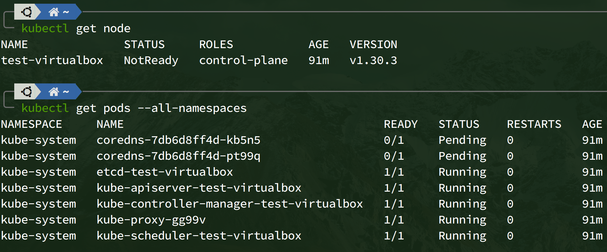
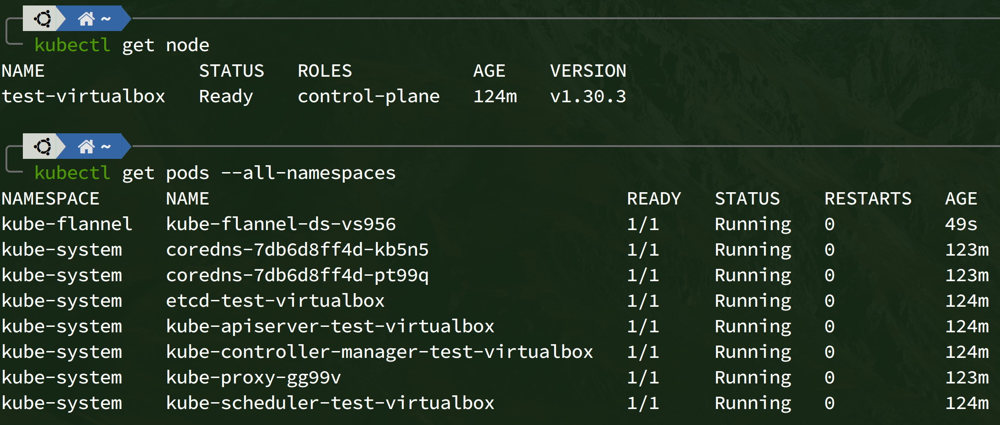

# Kubernetes_Single-Cluster

## Installation Guide

### Install CNI plugins

link: <https://github.com/containernetworking/plugins>

```shell
CNI_VERSION="v1.5.1"
mkdir -p /opt/cni/bin
curl -L "https://github.com/containernetworking/plugins/releases/download/${CNI_VERSION}/cni-plugins-linux-amd64-${CNI_VERSION}.tgz" | sudo tar -C /opt/cni/bin -xz
```

### Install crictl

link: <https://github.com/kubernetes-sigs/cri-tools>

```shell
CRICTL_VERSION="v1.30.1"
sudo mkdir -p /opt/bin
curl -L "https://github.com/kubernetes-incubator/cri-tools/releases/download/${CRICTL_VERSION}/crictl-${CRICTL_VERSION}-linux-amd64.tar.gz" | sudo tar -C /opt/bin -xz
```

### Install kubeadm, kubelet, kubectl

link: <https://kubernetes.io/docs/setup/production-environment/tools/kubeadm/install-kubeadm>

```shell
sudo apt-get update
# apt-transport-https may be a dummy package; if so, you can skip that package
sudo apt-get install -y apt-transport-https ca-certificates curl gpg

# If the directory `/etc/apt/keyrings` does not exist, it should be created before the curl command, read the note below.
# sudo mkdir -p -m 755 /etc/apt/keyrings
curl -fsSL https://pkgs.k8s.io/core:/stable:/v1.30/deb/Release.key | sudo gpg --dearmor -o /etc/apt/keyrings/kubernetes-apt-keyring.gpg

# This overwrites any existing configuration in /etc/apt/sources.list.d/kubernetes.list
echo 'deb [signed-by=/etc/apt/keyrings/kubernetes-apt-keyring.gpg] https://pkgs.k8s.io/core:/stable:/v1.30/deb/ /' | sudo tee /etc/apt/sources.list.d/kubernetes.list

sudo apt-get update
sudo apt-get install -y kubelet kubeadm kubectl
sudo apt-mark hold kubelet kubeadm kubectl

sudo systemctl enable --now kubelet
```

### Autocompelete

link: <https://kubernetes.io/docs/reference/kubectl/quick-reference/>

```shell
# alias
profile=~/.bashrc # or ~/.zshrc
echo 'alias k=kubectl' >> ${profile}

# for bash
source <(kubectl completion bash) # set up autocomplete in bash into the current shell, bash-completion package should be installed first.
echo "source <(kubectl completion bash)" >> ~/.bashrc # add autocomplete permanently to your bash shell.

# for zsh
source <(kubectl completion zsh)  # set up autocomplete in zsh into the current shell
echo '[[ $commands[kubectl] ]] && source <(kubectl completion zsh)' >> ~/.zshrc # add autocomplete permanently to your zsh shell
```

### About Swap

- <https://stackoverflow.com/a/69080860/15034335>
- <https://stackoverflow.com/a/62158455/15034335>

#### Disable swap

```shell
sudo swapoff -a && sudo sed -i '/swap/d' /etc/fstab
```

#### Install kubeadm with swap enabled

1. Create a file in `/etc/systemd/system/kubelet.service.d/20-allow-swap.conf` with the content:

   ```conf
   [Service]
   Environment="KUBELET_EXTRA_ARGS=--fail-swap-on=false"
   ```

2. Run

   ```shell
   sudo systemctl daemon-reload
   ```

3. Initialize `kubeadm` with flag `--ignore-preflight-errors=Swap`

   ```shell
   kubeadm init --ignore-preflight-errors=Swap
   ```

### CRI: Using Docker Engine for Kubernetes

link: <https://github.com/Mirantis/cri-dockerd>

```shell
CRI_DOCKERD=0.3.15
wget "https://github.com/Mirantis/cri-dockerd/releases/download/v${CRI_DOCKERD}/cri-dockerd_${CRI_DOCKERD}.3-0.ubuntu-jammy_amd64.deb"
sudo dpkg -i cri-dockerd_${CRI_DOCKERD}.3-0.ubuntu-jammy_amd64.deb

# Enable cri-docker.service
sudo systemctl daemon-reload
sudo systemctl enable cri-docker.service
sudo systemctl enable --now cri-docker.socket

# Check cri-docker status
sudo systemctl status cri-docker.socket
```

### kubeadm init

link: <https://kubernetes.io/docs/reference/setup-tools/kubeadm/kubeadm-init/>

```shell
# must enable kubelet first
sudo systemctl enable --now kubelet

# init with containerd
sudo kubeadm init --pod-network-cidr=10.244.0.0/16 --ignore-preflight-errors=Swap
# init with cri-dockerd
sudo kubeadm init --pod-network-cidr=10.244.0.0/16 --ignore-preflight-errors=Swap --cri-socket unix:///var/run/cri-dockerd.sock

# restart with cri-dockerd
sudo kubeadm reset --cri-socket unix:///var/run/cri-dockerd.sock
```

### kubectl non-root configuration

```shell
mkdir -p $HOME/.kube
sudo cp -i /etc/kubernetes/admin.conf $HOME/.kube/config
sudo chown $(id -u):$(id -g) $HOME/.kube/config
```

### Checkpoint



It is normal for the node status to be `NotReady`.
It is normal that the pods: `coredns-*`, READY: `0/1`.

### Install CNI(Flannel)

link: <https://github.com/flannel-io/flannel>

```shell
echo 'net.bridge.bridge-nf-call-iptables=1' | sudo tee -a /etc/sysctl.conf

kubectl apply -f https://github.com/flannel-io/flannel/releases/latest/download/kube-flannel.yml
```

### Remove Taints from Control Nodes

link: <https://kubernetes.io/docs/concepts/scheduling-eviction/taint-and-toleration/>
By default, the cluster does not schedule pods on control nodes. To create a single-node cluster, you must execute the following command.

```shell
kubectl taint nodes --all node-role.kubernetes.io/master-
```

### Final Check



## Reference

<https://blog.ooopiz.com/post/2019/07/creating-kubernetes-single-node-cluster/>
